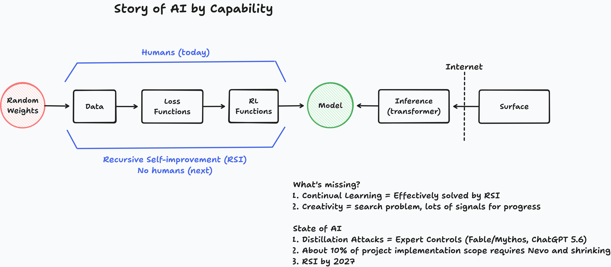

# State of AI

*by Buddy Williams · June 26, 2026*

---

## Introduction

If you went looking for a consensus on where AI is headed, you would come back empty-handed and probably more confused than when you started. The public conversation is genuinely all over the map. Yann LeCun, one of the people who built the field, argues that large language models are a dead end and that something architecturally different will be required for real intelligence. At the same time, the frontier labs are [wagering tens of billions of dollars on the opposite bet](https://x.com/dwarkesh_sp/status/2070551894674555081): that scaling laws carry today's models more or less straight to artificial general intelligence. These are not minor disagreements at the margins. They are flatly contradictory claims about the same technology, made by people who are not foolish and who are looking at much of the same evidence.

When serious people stare at the same data and reach opposite conclusions, the disagreement is usually not about the data. It is about the lens: *which view you take determines what you are able to see, and choosing the view is the real intellectual act.* Much of this, like Einstein, comes down to the analysis lens one takes. Most of the loud disagreement about AI is downstream of an unspoken choice of lens that almost nobody states out loud.

So this piece is less a forecast than an argument about how to forecast. I want to lay out the three lenses people are actually using, say which one I think is right and why, and then show you what that lens predicts. The short version of the predictions is at the top of the next section. The reasoning is the rest of the essay, because the reasoning is the part worth criticizing.

## Table of Contents

1. [The Short Version](#the-short-version)
2. [Why Some Forecasters Are Right](#why-some-forecasters-are-right)
3. [Three Lenses for Looking at AI](#three-lenses-for-looking-at-ai)
4. [What the Information Lens Predicts](#what-the-information-lens-predicts)
5. [Where the Work Goes: Hands, Heads, Hearts](#where-the-work-goes-hands-heads-hearts)
6. [Conclusion](#conclusion)
7. [Further Reading](#further-reading)

## The Short Version

For those who had to drop early, here is what I think the right lens implies, stated baldly so you can argue with it:

- **Recursive self-improvement (RSI)** — a system getting measurably better at the work of improving itself — is plausibly within reach around **2027**.
- RSI is what makes **continual learning** practical: models that keep updating from their own experience in deployment, rather than being trained once and then frozen.
- **Creativity** falls shortly thereafter. I do not think creativity is a particularly hard algorithm; I think it is a search problem — evolution stumbled into it, and we have abundant data of humans doing it. With continued data scaling and the feedback already flowing from millions of users, I expect it to emerge in models, not as a separate miracle.
- The center of gravity of human work moves outward in stages: from **Hands** (physical and agricultural labor) to **Heads** (knowledge work) to **Hearts** (social, relational, and care work). We are living through the automation of Heads right now.

If you only take one thing away, take the lens argument, not the dates. The dates are the part most likely to be wrong. The lens is the part that, if it is right, will keep being useful long after any particular date has passed.

## Why Some Forecasters Are Right

Before defending a lens, it is worth asking why lens choice matters so much — why some people are right about technology again and again while others, often with better credentials, are not.

I wrote about this at length in [The Metrics That Contain Their Causes](scm-methodology.md), and the central example there is Ray Kurzweil. Kurzweil self-reports something like an 86% historical accuracy rate on his technology predictions. Set aside whether that exact number survives scrutiny; the striking thing is that he was right about the long-run trajectory of computing for decades while frequently missing the specific inventions. The puzzle is how anyone can be that right about the direction while being so wrong about the particulars.

The answer is that Kurzweil was not doing empiricism, even though it looks like he was. He found what I call a **Success Compression Metric**: a single variable whose rise certifies that a whole hidden economy of prerequisite problems has already been solved. For Kurzweil that variable was compute per dollar. When compute rises, you know energy was generated, chips were fabricated at nanometer scale, capital was allocated, demand existed, and institutions held together well enough to keep it all running. The number is a certificate, not just a measurement.

Here is the part that matters for today's argument. The data can show that compute *has* risen. It can never show that it *will* rise. "Compute keeps rising" is a conjecture that selectively leans on past data to project a future the data cannot contain. And the genuinely predictive work was done before any of that: it was the decision to watch compute in the first place, rather than transistor counts, patent filings, or research headcount. Choosing compute as the lens — the one variable whose growth vouches for everything underneath it — is a theoretical act. It is a conjecture about which variable contains the causes. It is not a reading of the numbers, because the numbers do not tell you which of them to read.

That is the move I want you to hold onto. Forecasters who are repeatedly right are not better at staring at data. They are better at choosing the variable, and the choice is theoretical, not empirical. Which brings us to the disagreement about AI, which is at bottom a disagreement about which lens to choose.

## Three Lenses for Looking at AI

There are three lenses in wide use. They are rarely named, which is exactly why the arguments built on them talk past each other.

**The empirical lens.** This is the default, and it sounds like the most rigorous: look at what the systems actually do, benchmark them, extrapolate the curves. Its hidden weakness is the one Kurzweil's case already exposed. Data can tell you what has happened under certain controlled conditions. It cannot tell you what *will* happen, and it certainly cannot tell you what is *possible* but has not happened yet. This is not a quibble; it is the central result of twentieth-century philosophy of science. Karl Popper made the case for empirical knowledge in [*Conjectures and Refutations: The Growth of Scientific Knowledge*](https://www.amazon.com/Conjectures-Refutations-Scientific-Knowledge-Routledge/dp/0415285941) (1963): observation tests theories, it does not generate or certify them. Imre Lakatos showed the same logic runs through mathematics in [*Proofs and Refutations*](https://www.amazon.com/Proofs-Refutations-Mathematical-Discovery-Philosophy/dp/1107534054), where even proofs turn out to advance by conjecture and criticism rather than by accumulation of certainty. An empiricist looking at AI benchmarks is, without noticing, already making conjectures about which benchmarks matter and which trends will continue. The lens hides its own theoretical commitments behind the appearance of just looking.

**The neuroscience lens.** When direct data on a future capability is missing, most academics reach for the brain as the reference model. Demis Hassabis, who came to AI through neuroscience, is the clearest example: the implicit argument is that since the brain is the one general intelligence we have, the path to building one runs through understanding it. This lens is usually treated as empirical, an extension of looking at what exists. Its shortcoming is that it is **substrate-dependent**. Human brains are biological organs optimized by evolution for biological concerns — staying alive, reproducing, navigating a particular ancestral environment. Treating their specific architecture as the template for intelligence in general smuggles in the assumption that intelligence must resemble the one accidental implementation we happen to have. That is a strong assumption, and it is rarely defended as one.

**The information lens.** This is the one I think is right, and it is not yet the common view, though it is gaining ground. The idea is to treat intelligence as a phenomenon of *information* — what operations on information a system performs — rather than of the substrate that performs them. On this view the right question about a capability is never "does this work the way a brain works?" but "what information process does this capability require, and can that process run on any universal substrate?" Blaise Agüera y Arcas makes the information case directly in his book [*What Is Intelligence?*](https://mitpress.mit.edu/9780262049955/what-is-intelligence/), and the same lens is doing serious work elsewhere: age reversal research increasingly treats aging as a loss of information rather than mere physical wear, under the [Information Theory of Aging](https://x.com/davidasinclair/status/2065477182798057606). When the same lens starts paying off in unrelated fields, that is weak but real evidence the lens is carving reality closer to its joints.

The three lenses are not equally informative about the future, and that is the whole point. The empirical lens can only describe what already happened. The neuroscience lens can describe one implementation and tempts you to mistake it for the category. The information lens asks what is possible in principle for any system that processes information, which is the only one of the three that can speak about capabilities that do not exist yet. That is why I use it, and it is what the next section is built on.

## What the Information Lens Predicts

The diagram above is how I picture it. Today humans sit inside the training loop — choosing the data, the loss functions, the reinforcement signals that turn random weights into a model. Recursive self-improvement is what happens when that loop closes on itself and the humans step out of it. Continual learning gets effectively solved as a side effect of that closure, and creativity becomes a search problem with plenty of signal pointing the way. Hold the picture in mind for the rest of this section.

Adopt the information lens and the contradictory landscape from the introduction starts to resolve. The LeCun-versus-the-labs fight is largely a substrate argument: whether *this particular* architecture is the one. The information lens reframes it. The question is not whether large language models in their current form are the final design. It is whether the *information operations* that intelligence requires are now being performed, in some form, on a universal substrate. If they are, the specific architecture is a detail that the ordinary process of conjecture and criticism will keep refining — exactly as Kurzweil's argument predicted it would, without anyone needing to name the winning design in advance.

From here the predictions in the short version follow. The lens makes them *salient and plausible*; it does not prove them.

**Recursive self-improvement around 2027.** RSI means a system that gets measurably better at the task of improving itself — turning the search for better cognitive architectures partly inward. Under the information lens this is not a mystical threshold requiring a brain-like breakthrough. It is what happens when a system capable enough to contribute to its own training pipeline is pointed at that pipeline, with enough compute behind the search. The pieces — capable models, cheap search, automated experimentation — are converging, which is why a date this near is defensible. This is no longer a thought experiment the labs entertain at arm's length: [Anthropic](https://www.anthropic.com/institute/recursive-self-improvement) treats it as an explicit research objective, and OpenAI reports that a [recent model was already instrumental in building itself](https://www.nbcnews.com/tech/innovation/openai-says-new-codex-coding-model-helped-build-rcna257521).

**Continual learning.** Today's models are trained once and then frozen; they do not learn from what happens after deployment. Continual learning closes that gap — the system keeps updating from its own experience in the field. The usual framing treats this as a hard architectural problem: how to keep learning without destabilizing what the model already knows, a question of how information flows through the system over time rather than how to replicate biological memory. RSI helps there directly, since a system improving its own training pipeline can attack those stability problems.

But there is a simpler flywheel I rarely see discussed, and it may matter more. Picture training as a loop with a delay. A frontier model is retrained end to end on a timescale of months, so it stays frozen for months at a stretch. Once that training is fully automated — humans out of the inner loop, which is just what RSI means — the loop becomes something competition relentlessly optimizes, and demand for narrower, use-case-specific models adds to the pressure. Every prior wave of technology shows the same arc: the first flat-screen televisions were luxuries until economies of scale ground their cost down to ambient. Model training will follow it, and the loop contracts — three months, then three weeks, then three days, then three hours. The point is that continual learning need not be solved as a distinct capability at all; it is solved by whatever delay the loop consumes. A model that fully retrains overnight, in less than the eight hours a person spends asleep, is for every practical purpose learning continuously — it wakes having absorbed yesterday. "Frozen" stops being a fact about the architecture and becomes a fact about the clock, and the clock is what RSI and competition are already driving down.

**Creativity shortly thereafter.** This is the boldest claim, and I defend it more fully in [Computer People](computer-people.md). I do not think creativity is a particularly hard algorithm. I think it is a search problem, and two things convince me of that. Evolution, a blind search with no foresight at all, produced creativity anyway. And we have an enormous amount of data showing humans being creative — which is to say, data showing the search being run well. My hunch is that the search has a shape: problems lead to questions, questions draw on experience and priors, and solutions fall out of the constrained space those priors carve out. On the information lens this is just conjecture and criticism running over time, which is why I expect creativity to follow continual learning closely rather than wait on a separate breakthrough. Models obviously need feedback, but the usage from millions of people already supplies it. With continued scaling, especially curated data scaling, the search has what it needs to keep getting better.

The thread connecting all three is that none of them depends on the system resembling a brain. They depend only on certain information operations being performed continuously on a substrate capable of universal computation. That is why the information lens sees them as near, while the neuroscience lens keeps waiting for the architecture to look more like us, and the empirical lens keeps insisting it cannot say anything until the capability has already arrived.

## Where the Work Goes: Hands, Heads, Hearts

The capability story has an economic shadow, and it is the part most of you will feel directly. As machines absorb more kinds of work, the center of gravity of distinctly human labor keeps moving outward, and it moves in a recognizable order: from **Hands** to **Heads** to **Hearts**.

**Hands** is physical labor — the agricultural and manual work that occupied almost everyone for almost all of history. Mechanization moved most of humanity off the land and into offices and factories. That transition is largely complete in the developed world, and we rarely mourn it.

**Heads** is knowledge work — analysis, writing, coding, design, the manipulation of symbols and information. This is the domain we are watching get automated right now, and it is disorienting precisely because so many of us built our identities on being good at it. When the thing that made you economically valuable can be done by a system that does not sleep, the question of what your contribution *is* stops being abstract.

**Hearts** is social and relational work — social games/eSports, aesthetics/art, and communities is the work that is fundamentally about one being's relationship to another. This is where human attention migrates next, and the reason is not the one usually offered. It is simpler: humans live alongside other humans and never stop relating to one another. What changes is where our attention falls. Right now it is consumed by cognition — the Heads work AI is busy dissolving. As that consumption lifts, the relational side of humanity does not so much appear as get uncovered: with the older labor no longer demanding our attention, the nature of human relationship is thrown into relief and pursued. Expect it to explode. And our hands and heads are not left idle; they are redirected toward relationship. A human carries all three — hands, head, and heart — and once the first two are no longer claimed by survival and cognition, the whole of us can be aimed at the highest ambition of the three: the heart. Look at where status and money already flow in places that were never bottlenecked by manual or cognitive scarcity: co-operative video games and esports, where the prized skill is reading and coordinating with other people in real time, and influencers, whose entire output is relationship at scale. The scarce, valued skill in those worlds is social skill. As manual and cognitive labor are automated, relational work becomes the next wave of paid labor — and beyond paid labor, the place we devote our time.

This is an economic conjecture layered on a capability conjecture, so it inherits the uncertainty of both. But it rhymes with every previous technological transition, where human work was not destroyed so much as relocated. The difference this time is that the machine operates on cognition itself, so the relocation cannot stop at some new category of cognitive task. It runs all the way out to the heart — to where being with and for other people is the point rather than the means.

## Conclusion

The pieces of this essay are meant to be read as a single chain. Recursive self-improvement is the first link: once a system can improve the process that improves it, the rest follows with less friction than it looks. RSI makes continual learning practical, because a system improving its own training pipeline drives the retraining loop short enough that the model keeps updating from experience instead of freezing at the end of a training run. Continual learning is in turn the condition under which creativity emerges — not as a separate miracle but as a search that finally runs without interruption, with the usage of millions of people supplying the feedback. A system that learns continuously and creates is a universal explainer, which is what I mean by AGI and what I develop at length in [Computer People](computer-people.md). And a world with universal explainers in it is one where human work and human attention move outward to the last ring — to hearts, to the relational life that is where we were always heading once the machines took the hands and the heads.

None of this depends on a brain-like breakthrough or on naming the winning architecture in advance. It depends on the information lens being the right one: the choice to track what operations on information are being performed rather than what substrate performs them. Through that lens the chain is visible. Through the empirical lens it is not, because data can only describe what has already happened; and through the neuroscience lens it is not, because the brain is only the one implementation we happened to inherit.

I could be wrong about the dates — I probably am, somewhere — and I would rather be precisely wrong from a stated lens than vaguely right from a hidden one. The chain is a conjecture. Find the link that breaks, and tell me where.

## Further Reading

For the case that lens choice, not pedigree, separates good forecasters from bad: [The Metrics That Contain Their Causes](scm-methodology.md).

For more on the information lens specifically:

- [Computer People](computer-people.md) — whether AIs can be genuinely creative, and what that implies about personhood.
- [Metaprogramming Framework To Classify Personhood](framework-of-personhood.md) — what capabilities AGI actually requires, from an information-ontology perspective.
- [Living Above the Models](live-above.md) — on escaping inherited human bias and holding inherited frameworks loosely.
