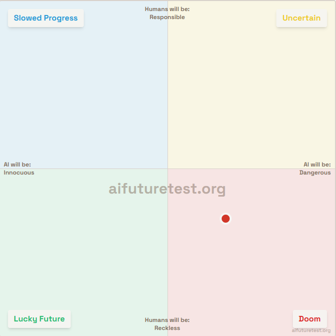

# Against AI Futures Quadrants

*Why two-dimensional framing of AI outcomes is dangerously reductive*

**Buddy Williams** · October 5, 2025 · [Originally posted on X](https://x.com/BuddyIterate)

---

A member from my rationalist community shared the quadrant provided by EA:

I had an immediate reaction to the framing.

**TLDR:** I do not believe this type of framing can be accurate [currently impossible]. I do believe it serves a function: to radicalize others, and probably by accident. Radicalization seems to be self-reproducing, much like a virus [I do not have a negative connotation in mind].

---

## Why Not Build My Own Categories?

I could attempt to create my own categories, but it doesn't seem necessary. I just need to show that there are other options.

In my view, there are numerous other options, so I could not build my own categories with much confidence, and the attempt would likely make me more confident than I'd like to be.

---

## Showing the Matrix Categories Are Not Conclusive

**"Humans will be responsible or humans will be reckless"** — implies that the fate of AI requires our willful choice and awareness. It makes assertions about the nature of reality.

As a counterexample: perhaps what is happening is a case of hierarchical complexity — simpler systems give rise to more complex systems. Are we cells in a larger organism? This does not necessitate doom. In fact, we [humans] may be a necessary part of a greater system.

**"AI will be Innocuous or AI will be Dangerous"** — implies an anthropocentric view of future outcomes, which seems to frame transhumanism as an undesirable outcome.

Maybe humans and AI co-evolve, or where the concept of 'danger' ceases to be meaningful.

---

## The Reductionism Problem

I continue to see reductionist methods [subtracting complexity] applied to AI projections.

The matrix above is an egregious example of false framing. It assumes a great many values from its consumers [humans] and assumes even more from the nature of reality [quantification, predictability].

---

## My Own Views

I do not hold a uniquely special place for humanity in the limit. We are obviously quite special at the moment.

I find immense beauty and joy in being human. I love my children, friends, and family. I enjoy the many pleasures of life and overcoming some of its challenges.

I suspect, however, that **the nature of reality is a bit more strange and surprising**.

At both macro and micro scales [zoom, time], to use an analogy, we are looking at AI as Aristotle looked at the sky, when Galileo, Newton, and quantum mechanics are around the corner.

---

## Therefore

**It is not possible to enumerate the option set of AI outcomes, let alone predict the likelihood of a branch.**

For example, early on, there was a fear of AI Takeoff, then AI Takeover. Since then, to the surprise of many superforecasters, language has become the medium, making interpretability a bit easier. Obviously, EY, his followers, and others still have this fear.

Perhaps it would be more fractal-like than a two-dimensional chart.

---

## Does Unpredictability Lead to Fatalism?

No. I have written about that elsewhere:

> "I see the social situation as two adversarial purposes/groups at work: (1) people that explore the pure philosophy of intelligence, which rightly approximates AI risk via the orthogonal thesis; (2) people that build AI in the real world. The first group acts as an immune system for the second group. This is good because we do not want to build the Torment Nexus.
>
> This immune group [AI safety zealots] must, by definition, be adversarial and somewhat delusional; otherwise, they may lack the appropriate motivation to keep us [humans] healthy. As an alternative to true delusion, they may also project delusion as a manipulation tactic. This last method seems to belong to the most intelligent among us.
>
> Is it possible we build the Torment Nexus? Yes. Is it guaranteed? No. I'm personally optimistic."

---

## Summary

This chart oversimplifies a highly multidimensional space into a binary moral axis ('responsible vs reckless') and a binary technological axis ('innocuous vs dangerous'). That framing narrows the debate and can unintentionally polarize people.

In reality, AI futures are more like a **fractal outcome space** — intertwined trajectories of humans and machines, emergent properties we can't yet model, and feedback loops between safety and capability.

A more useful visualization might show overlapping distributions or evolutionary paths rather than fixed quadrants.

**The point isn't to reject all frameworks, but to stay humble about how little we can predict and to focus on building resilient systems.**
