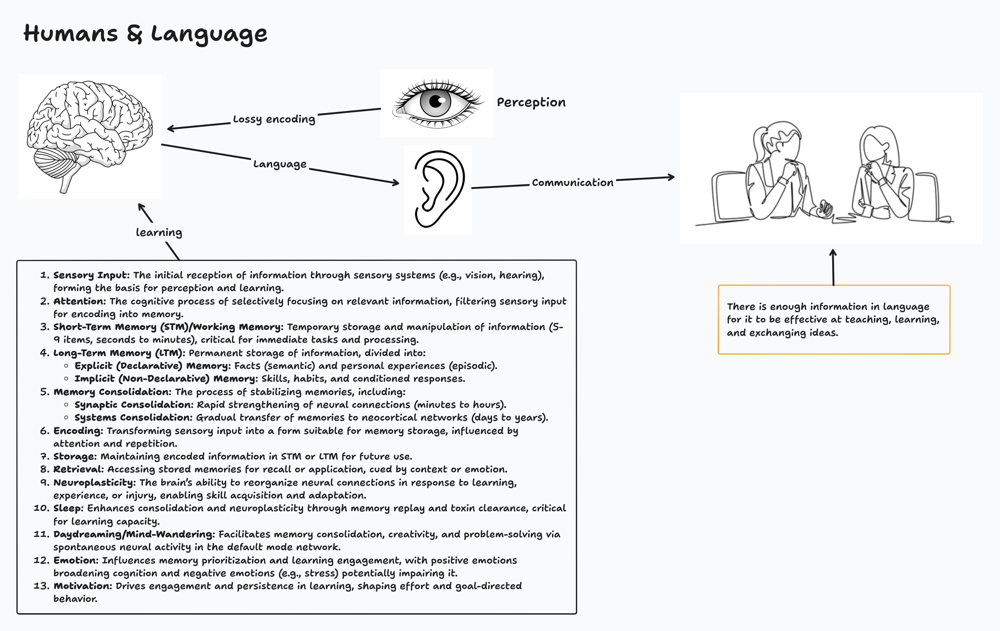
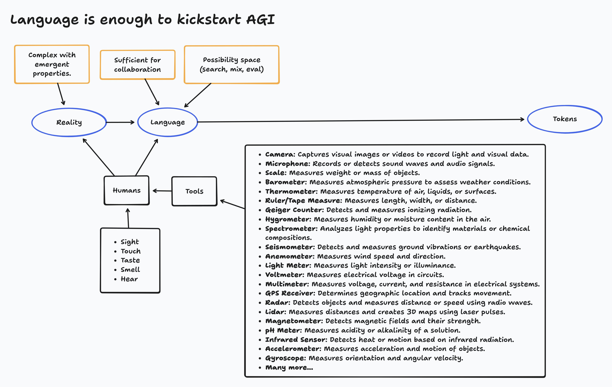
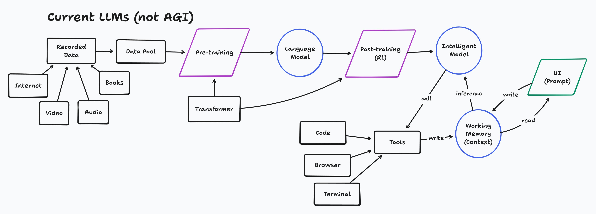
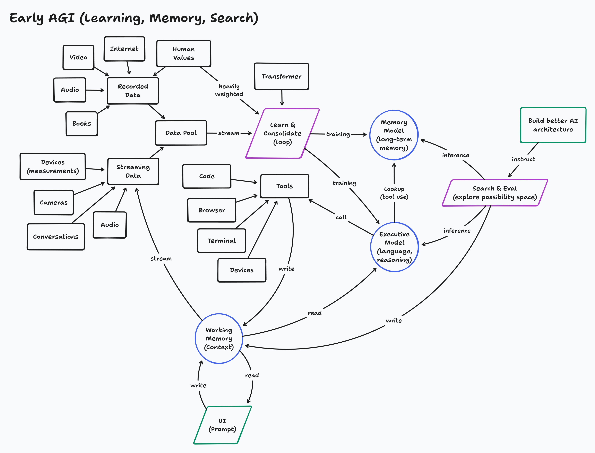

# AGI From Existing Components

*A proposal for achieving AGI through integration rather than invention*

**Buddy Williams** · August 10, 2025 · [Originally posted on X](https://x.com/BuddyIterate/status/1954519434996896042)

---

I propose that AGI can be achieved by integrating existing LLM components rather than requiring a groundbreaking new architecture.

At the core, **language serves as a lossy yet effective medium for representing reality**, providing a foundation for exploration. This is enhanced by:

- **Real-time streaming data** from sources like cameras and microphones
- **Continuous model updates** for adaptability
- **Persistent memory** for context
- **Symbolic tools** for structured reasoning
- **A dedicated evaluation module** to assess logical consistency and exploratory value

Search mechanisms drive novelty and versatility by iteratively exploring possibility spaces and refining outputs.

The key lies in assembling these elements into a cohesive, evolving system, leveraging current technology to bridge the gap to AGI. This will give rise to early AGI which will lead to better architectures.

*There is more work to be done in exploring this theory since it is still in the concept phase.*

---

## Diagrams

### 1. Humans & Language

How humans process and communicate through language — the cognitive foundation that AI mirrors.

Key insight: *There is enough information in language for it to be effective at teaching, learning, and exchanging ideas.*

---

### 2. Language is Enough to Kickstart AGI

Language connects reality to tokens through humans and tools. The path from complex reality to computable representation.

Properties of language:
- Complex with emergent properties
- Sufficient for collaboration
- Enables possibility space exploration (search, mix, eval)

---

### 3. Current LLMs (Not AGI)

The current architecture: recorded data → pre-training → post-training → inference with tools and working memory.

What's missing: continuous learning, long-term memory, and autonomous search/evaluation.

---

### 4. Early AGI Architecture

The proposed architecture adds streaming data, continuous learning loops, memory models, and search/eval mechanisms.

Key additions:
- **Learn & Consolidate loop** — continuous training from streaming data
- **Memory Model** — long-term memory separate from working memory
- **Search & Eval** — autonomous exploration of possibility space
- **Executive Model** — language and reasoning coordination
- Feedback loop to **build better AI architecture**

---

## Status

This is still in the concept phase. The thesis: we don't need a fundamentally new architecture — we need better integration of existing components with continuous learning and memory.
