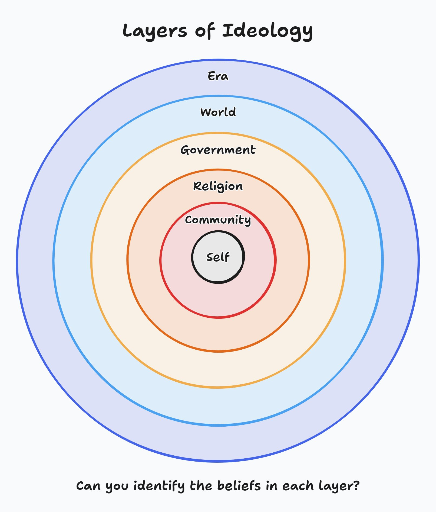

# Layers of Ideology

*The influences on our minds we take for granted*

**Buddy Williams** · September 11, 2025 · [Originally posted on X](https://x.com/BuddyIterate)

---

*Can you identify the beliefs in each layer?*

---

I've been thinking about the influences on our minds.

They are not inherently bad, but **not knowing they exist and what they are is bad**. In the same way a cult can imprison a mind, so can the ideologies we take for granted.

---

## Questions Worth Asking

Do you, like me, find it a bit unusual that people tend to subscribe to the religion of their birthplace?

What about politics?

What about time period — it's 2025, will people feel different in 2125?

---

## A Call to Open-Mindedness

This is a call to be more open-minded.

The things that you are so certain of, that you've staked your entire life on, may be entirely fictional.

**It's worth considering.**
