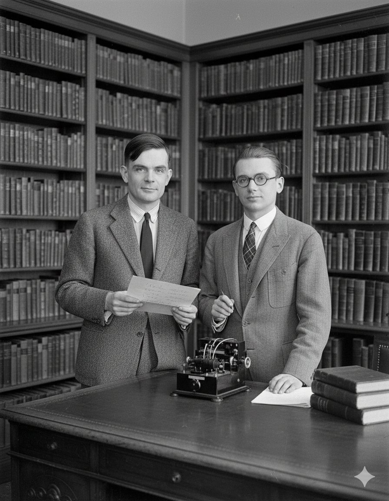

# The Sadness and Hope of Being a Pioneer

*What wisdom is to be learned from the lives of pioneers?*

**Buddy Williams** · September 29, 2025 · [Originally posted on X](https://x.com/BuddyIterate)

---

---

**Alan Turing** likely killed himself because his sexuality was unacceptable to society. Turing had to question norms — that is how you get breakthroughs. Maybe his normal was society's unacceptable.

**Kurt Gödel** thought he was being poisoned and starved himself to death. I'm unsure why Gödel went mad. I can imagine that his work made him feel like an outsider. For example, Albert Einstein convinced him to not discuss the logical contradiction he found in the U.S. Constitution during his citizenship interview.

Together they triumphed over Hilbert's questions:
- **Is math complete?** No. (Gödel)
- **Is every math statement decidable?** No. (Turing)

Both suffered horribly.

---

## The Chasm

At what point do you become a non-normal when your whole life is questioning normal?

As I continue to pursue insights and truth, I can feel a chasm forming between myself and normal people. This chasm is widened by a pursuit for inquiry and truth.

What widens the chasm:
- Point out contradictions in a group's core beliefs
- Show how someone's work is flawed
- Live against societal expectations
- Prove a belief that is disruptive

**People do not want truth. People want delusion. People want to belong.**

When all you have to offer is truth, you have nothing to offer.

This is a sad trend about human nature: we hate our pioneers.

---

## Survival

Survival at this point seems to be:
- Suspending belief
- Hiding your truth
- Drinking the pink colored sugar water

I'm grateful for the few that love me because otherwise I think I'd feel utterly alone. **Loneliness seems to be a crucial thing to defend against.**

---

## The Shield

If that is the only picture, it's bleak at best. But not all pioneers are destroyed by truth. Some found ways to thrive:

- **Galileo:** framed disruption as dialogue
- **Feynman:** used humor and joy as shields
- **Curie:** let results outlive prejudice
- **Sagan:** wrapped truth in beauty

**Pioneers thrive when they offer truth as service, wonder, or humor.**

What looks like subservience from the outside is often just storycraft: shaping truth into a form people can digest, even if it ultimately undercuts their illusions.

So, while many pioneers have fallen to despair, there is hope in the form of a shield. A shield is a powerful concept. It's a bridge between intelligence and belonging. That really does seem to be a winning strategy.

---

## Shields I See

For a while, I've noticed that Elon has gone out of his way to make jokes, memes, and laugh. Maybe that is his shield.

I don't see a shield in place for Peter Thiel, which is concerning.

My partner uses humor.

I think for me, a real sense of **inspiration, wonder, and awe** — that's my shield.
